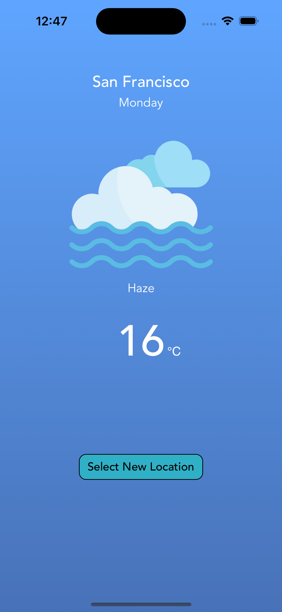
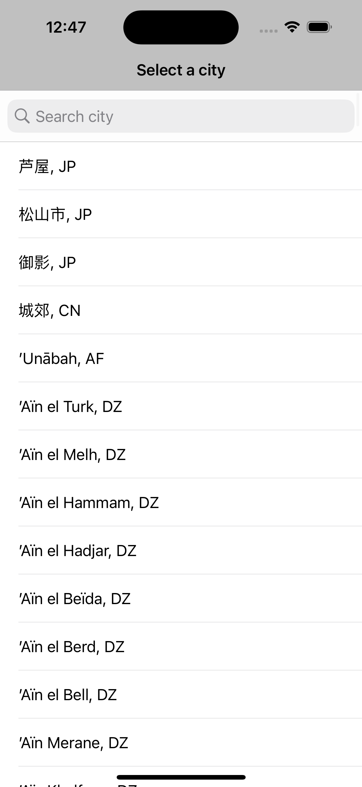
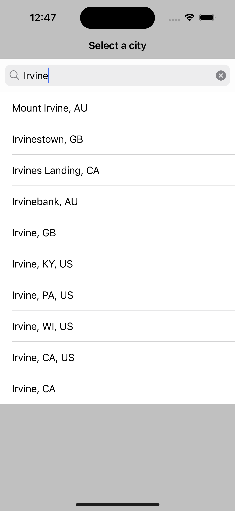

# Weather APP IOS

## Credits
- The Basic Design for the APP has been referred from the [D-Bug Youtube Community](https://www.youtube.com/watch?v=WHRntPeAOo4
).
- City List downloaded from OpenWeather Website

## About the APP
Weather APP IOS is a mobile application that displays weather information based on selected city by the User.
By default, it displays San Francisco's locaiton , but the User can view weather info for any city they want from the list of cities available.

## Improvements made on the APP
- Added an Icon for the applicaiton
- Added a feature to select any city across the globe
- Added a search functionality to search for the city.

## Requirements
- User permission for location access

## How to Run
- Unzip the Folder
- Install Xcode on your machine
- Open the Project Folder in Xcode
- Set targets minimum deployment to 13.0
- Download Simulator 
- Build the Application 
- You will be prompted for Location Access , kindly grant it to use the APP.
- Select a City of your choice to get the weather information.

## Screens
1. **Home Screen** - Home Screen Shows Weather Info for San Francisco. 
    
    
3. **Select Location** - Select any city from the given city options.  
    
4. **Search City** - Search for a city.  
    
5. **City Weather** - Displays weather data for the selected city.  
    
6. **Dark Mode** - App look and feel in dark mode.
  
 

Copyright &copy; 2023 Aswin Sampath.

Made with 💛 by Aswin Sampath

